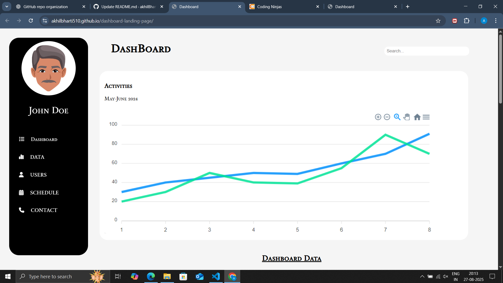
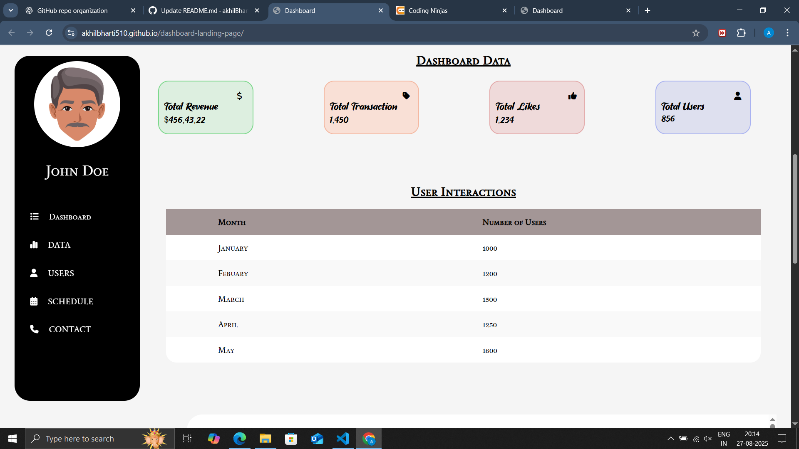
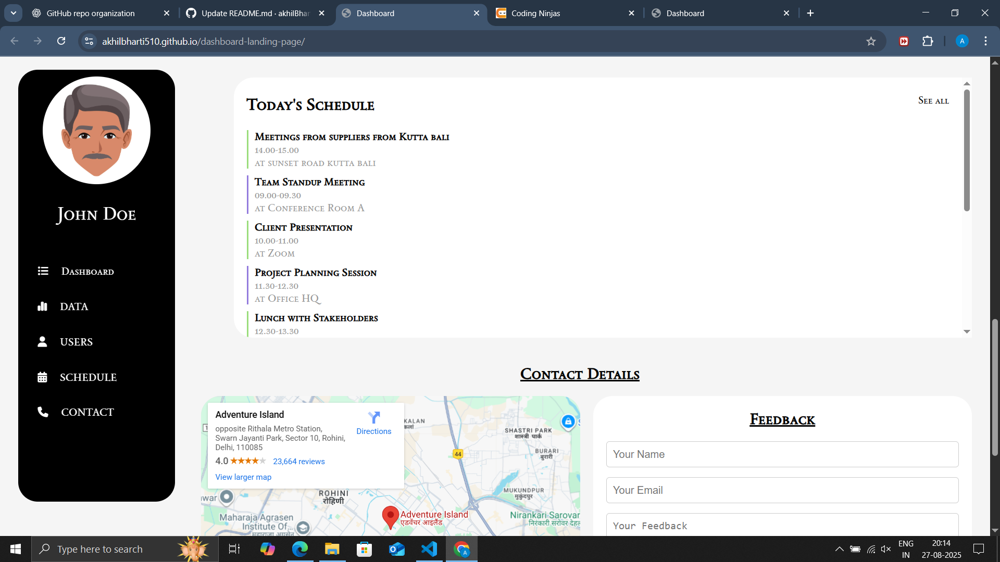
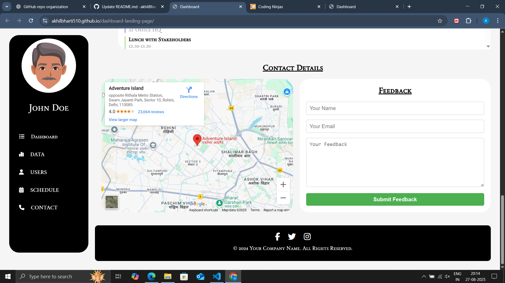

# 📊 Dashboard Landing Page

A responsive and modern **Dashboard Landing Page** built using **HTML & CSS**.  
It showcases dashboard features like charts, user data, schedule management, contact form, and more.  

🌐 **Live Demo:** [View Here](https://akhilbharti510.github.io/dashboard-landing-page/)

---

## 🚀 Features
- 📈 Interactive Dashboard with activity chart  
- 👤 Sidebar navigation with sections: Dashboard, Data, Users, Schedule, Contact  
- 💰 Dashboard stats: Revenue, Transactions, Likes, Users  
- 📅 User interactions & monthly data  
- 🗓️ Schedule section with meetings & events  
- 🗺️ Embedded Google Maps for location  
- ✉️ Contact form with feedback option  
- 📱 Fully responsive design  

## 🌐 Live Demo
[Click here to view the project]([https://<your-username>.github.io/dashboard-landing-page/](https://akhilbharti510.github.io/dashboard-landing-page/))

## 📸 Screenshots

### Dashboard Overview

### Dashboard Data

### Schedule Section

### Contact & Feedback

---

## 🛠️ Tech Stack
- **HTML5**
- **CSS3**

---

## 📂 Project Structure
dashboard-landing-page/
│── index.html
│── style.css
│── /img
│ └── BarGraph.png
│ └── man.png
│── /screenshots
│ └── screen1.png
│ └── screen2.png
│ └── screen3.png
│ └── screen4.png